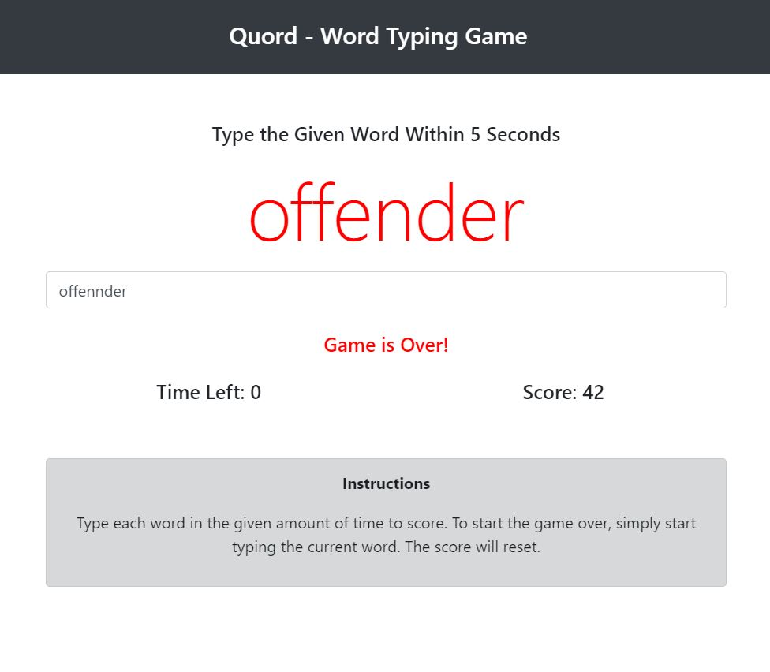

# Quord (quick Word) - Immersive Typing game - type a given word within 5 seconds!
# [Try Game](https://assainov.github.io/quordTypingGame)
## Purpose: to challenge myself think algoryhtmically and practice OOP with ES6 Classes.
## Try that game now! My record was 122 words, what will be yours?

### Tehcnologies used: Bootstrap UI, OOP JavaScript, ES6 Classes, Fetch API from a local file with 2000 words

